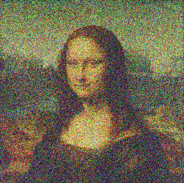

# Genetic Image Construction
---

This application was the final course project for my Principles of Programming course. We were tasked to create a **genetic algorithm** for the recreation of a given image starting from a randomaly generated PPM image. To further improve the accuracy of the produced image, an **Exponentially Decaying Adaptive Learning Rate** was applied to the algorithm.

The program works by randomizing pixels and then using mutation and crossover to obtain an image closely resembling the inputted image. This is done by creating a population of randomized images using a pixel data structure, calculating the fitness score of each image and then ordering the images from highest to lowest fitness. Finally, the least fit 75% of the population images are then mutated, and the fitness is calculated again. This process is repeated until a close enough resembling image is reached. As a result, the recreated images achieved roughly **87% accuracy** and the exponentially decaying adaptive learning rate demonstrated a **12% increase in efficiency**.

## Mona Lisa Construction
Depicted below is the construction of "Mona Lisa" by the Genetic Algorithm.

### Original & Constructed Image

### Gif of Image Recreation

## Escher Construction
Depicted below is the construction of "M.C. Escher: In His Mind's Eye" by the Genetic Algorithm.

### Original & Constructed Image

### Gif of Image Recreation

